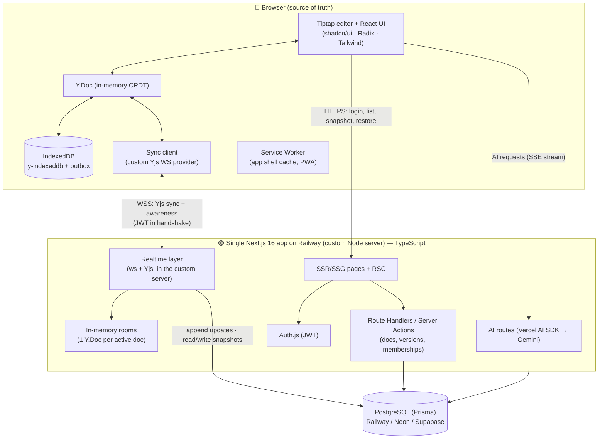
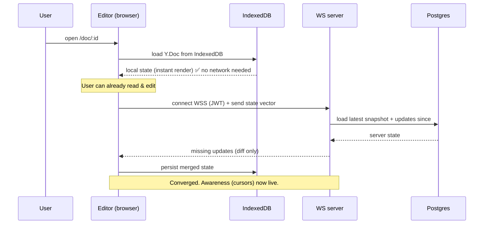
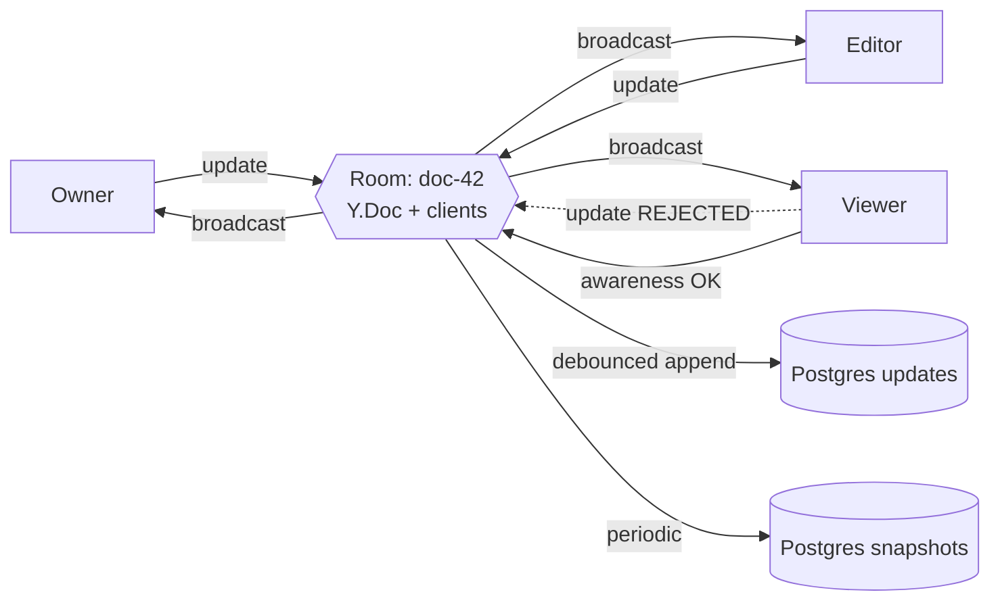

# 02 — System Architecture

## 1. Mental model

Conflux is **two runtimes** that agree on one document:

1. **The browser** — owns the canonical state (IndexedDB), runs the editor, merges CRDT updates,
   queues offline work. The user's truth lives here first.
2. **One Next.js 16 application** (frontend **and** backend, TypeScript) — auth, REST/Server Actions
   for documents/versions/memberships, SSR/SSG pages, AI endpoints, **and** the realtime WebSocket
   layer (one in-memory CRDT doc per active room, role enforcement, payload validation, durable
   persistence). It runs with a **custom Node server** so it can hold long-lived sockets, and talks to
   PostgreSQL via Prisma.

Per the assignment's **"Backend/Frontend: Next.js 16"** mandate, there is **no separate backend
service** — the realtime layer is a module _inside_ the same Next.js app (a custom `server.ts` entry +
`lib/realtime/`). It can't run on Vercel serverless (no persistent sockets), so the app is deployed on
a host that supports a long-lived process (**Railway**). Rationale and the rejected
"Vercel + separate WS service" option are in
[03-tech-stack-decisions.md](./03-tech-stack-decisions.md) ADR-4 and
[16-pdf-compliance-audit.md](./16-pdf-compliance-audit.md) Decision 1.

## 2. Component diagram



> "WS server" / "realtime server" elsewhere in these docs = this **realtime layer inside the Next.js
> custom server**, not a separate deployable.

## 3. Why each boundary is where it is

| Boundary                                           | Rationale                                                                                                            |
| -------------------------------------------------- | -------------------------------------------------------------------------------------------------------------------- |
| Editor + CRDT in the browser                       | Local-first (F1): rendering and input must never block on network.                                                   |
| Persistence in IndexedDB                           | Survives reload, tab close, and offline sessions; large binary-safe store.                                           |
| One Next.js 16 app (frontend + backend + realtime) | The PDF mandates "Backend/Frontend: Next.js 16" — one codebase, one language (TS), no separate service.              |
| Custom Node server hosting the app                 | Lets the same Next.js app hold long-lived WebSockets + per-room CRDT state (impossible on serverless).               |
| Deployed on Railway (not Vercel)                   | A persistent process is required for sockets; Vercel serverless can't provide it. Railway is in the JD's cloud list. |
| Postgres behind the app                            | Single source of durable truth for metadata, memberships, updates, snapshots.                                        |

The app tier and the realtime tier **share the same Postgres and the same JWT secret**, so the WS
server can authenticate users and enforce roles without a second login.

## 4. Request/data flows

### 4.1 Open a document (cold, offline-capable)



### 4.2 Edit while offline → reconnect

```mermaid
sequenceDiagram
  participant E as Editor (offline)
  participant I as IndexedDB (+ outbox)
  participant W as WS server

  E->>E: keystrokes → Y.Doc updates (local, instant)
  E->>I: persist every update + enqueue in outbox
  Note over E: network down — UI shows "Offline, saved locally"
  E-->>W: (reconnect) handshake with state vector
  W-->>E: remote updates we missed
  E->>W: flush outbox (our updates) — idempotent
  Note over E,W: CRDT merges both directions; no overwrite (F2)
```

### 4.3 Capture & restore a version (non-destructive)

See [07-version-history.md](./07-version-history.md) for the full sequence — the key property is that
**restore moves the document _forward_ to old content**, it never rewinds the shared op log.

## 5. The realtime sync server (room model)

- One **room** per `documentId`. A room holds a single authoritative in-memory `Y.Doc` and the set of
  connected clients with their roles.
- On connect: verify JWT → look up membership → attach `role` to the connection. **Viewers are
  flagged read-only**; their inbound `sync`/`update` messages are dropped (M3). Awareness (cursor
  presence) is allowed for everyone.
- On update from an Editor/Owner: validate (size + decode), apply to the room doc, broadcast to
  peers, and **append to Postgres** (the update log).
- Rooms are **lazy**: created on first join, torn down (after flushing/compacting) when empty.
- Persistence is **debounced + append-only**, with periodic compaction into a snapshot to bound
  storage and reload cost (see [11](./11-performance-and-scale.md)).



## 6. Application structure — one Next.js 16 app (App Router + custom server)

```
server.ts                     # custom Node entry: Next.js handler + WebSocket (realtime layer)
app/
  (marketing)/                # SSG — landing, about (static)
  (auth)/sign-in, sign-up     # Auth.js pages
  (app)/
    layout.tsx                # authenticated shell + <SiteFooter/>
    documents/                # SSR list of the user's docs
    documents/[id]/           # editor route — <Editor/> dynamically imported, ssr:false
  api/
    auth/[...nextauth]/       # Auth.js route handler
    documents/                # REST: CRUD + membership
    documents/[id]/versions/  # REST: snapshot list / create / restore
    ai/{summarize,assist,diff}/  # AI streaming endpoints
components/
  editor/                     # Tiptap wiring, presence cursors, toolbar
  sync/                       # connection-status indicator, sync state hooks
  ui/                         # shadcn/ui components
lib/
  crdt/                       # Y.Doc factory, providers (indexeddb, ws), snapshot utils
  sync/                       # client outbox, reconnection/backoff, state machine
  realtime/                   # server-side: rooms, auth+role enforcement, payload validation, persistence
  auth/                       # Auth.js config, role guards
  db/                         # Prisma client + scoped query helpers
  validators/                 # Zod schemas (shared by route handlers + realtime layer)
  ai/                         # Vercel AI SDK (Google) clients + prompts
```

Everything is **one Next.js 16 app, one TypeScript codebase** — no monorepo, no separate backend
service. The realtime WebSocket layer lives in `server.ts` + `lib/realtime/` and **imports the same
Prisma client and the same Zod validators** as the REST route handlers, so schema and validation can't
drift between HTTP and socket paths.

### 6.1 Client state management — Hooks, Context API, Query Params

The assignment names these React state mechanisms explicitly, and we use each where it fits best:

| Mechanism                                                                                          | Used for                                                                                                                                                                                                 |
| -------------------------------------------------------------------------------------------------- | -------------------------------------------------------------------------------------------------------------------------------------------------------------------------------------------------------- |
| **Hooks** (`useState`/`useEffect`/`useReducer` + custom hooks like `useSyncStatus`, `useDocument`) | Local component state and the sync-engine bindings                                                                                                                                                       |
| **Context API**                                                                                    | Cross-cutting client state that many components read: authenticated user/session, theme, and the live sync/connection status — provided once near the app shell, consumed anywhere without prop-drilling |
| **Query Params** (`searchParams`)                                                                  | Shareable, navigable state: `?version=<id>` to deep-link a version preview in the timeline, and the documents list filters `?search=&sort=&page=` — so URLs are linkable and back/forward works          |

Document content itself is **not** React state — it lives in the CRDT (`Y.Doc`) and is bound to the
editor; React state is only for UI/session concerns. This keeps rapid typing off the React re-render
path ([11](./11-performance-and-scale.md)).

## 7. UX: states the UI must make visible (evaluation calls this out explicitly)

A **persistent connection-status indicator** is a first-class component, not an afterthought:

| State          | Indicator                                | Meaning                            |
| -------------- | ---------------------------------------- | ---------------------------------- |
| `synced`       | green dot · "All changes saved"          | Local == server, socket healthy    |
| `syncing`      | spinner · "Syncing…"                     | Flushing outbox / applying remote  |
| `offline`      | amber · "Offline — saved on this device" | No socket; edits durable locally   |
| `reconnecting` | amber pulse · "Reconnecting…"            | Backoff in progress                |
| `read-only`    | lock · "View only"                       | Viewer role; editor input disabled |
| `error`        | red · actionable message                 | Validation/permission/server error |

Plus: live **collaborator avatars + colored cursors** (Yjs awareness), a **version-history panel**,
and toasts for restore/permission events. Accessibility: Radix primitives, full keyboard nav,
`aria-live` region announcing sync-state transitions, visible focus, color-independent status (icon +
text, not color alone).

## 8. Footer (submission requirement)

`components/site-footer.tsx`, rendered in the authenticated and marketing layouts, containing
**name · GitHub profile · LinkedIn profile** (real values filled before submission). Keyboard
focusable, `rel="noopener noreferrer"` on external links.
