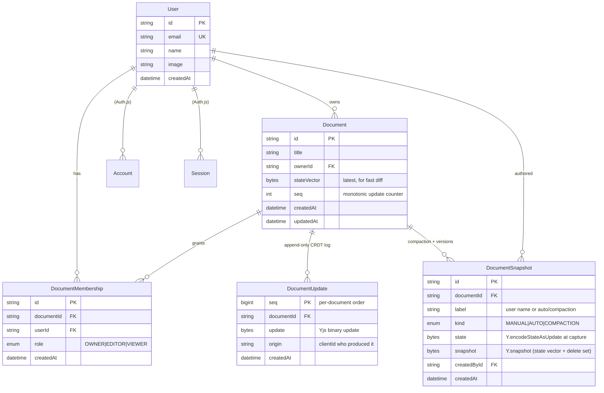

# 04 — Data Model

PostgreSQL schema (via Prisma). The model serves four jobs: **identity/auth**, **document
ownership + RBAC**, **durable CRDT state** (update log + snapshots), and **version history**.

## 1. Entity-relationship overview



## 2. Prisma schema (sketch)

```prisma
// prisma/schema.prisma  (one schema; imported by the route handlers and the realtime layer)

generator client { provider = "prisma-client-js" }
datasource db    { provider = "postgresql"; url = env("DATABASE_URL") }

enum Role        { OWNER EDITOR VIEWER }
enum SnapshotKind { MANUAL AUTO COMPACTION }

model User {
  id           String   @id @default(cuid())
  email        String   @unique
  name         String?
  image        String?
  createdAt    DateTime @default(now())

  ownedDocs    Document[]           @relation("owner")
  memberships  DocumentMembership[]
  snapshots    DocumentSnapshot[]
  accounts     Account[]            // Auth.js
  sessions     Session[]            // Auth.js
}

model Document {
  id          String   @id @default(cuid())
  title       String   @default("Untitled")
  ownerId     String
  owner       User     @relation("owner", fields: [ownerId], references: [id], onDelete: Cascade)
  stateVector Bytes?                       // cached latest SV for quick diffs
  seq         BigInt   @default(0)         // monotonic update sequence
  createdAt   DateTime @default(now())
  updatedAt   DateTime @updatedAt

  memberships DocumentMembership[]
  updates     DocumentUpdate[]
  snapshots   DocumentSnapshot[]

  @@index([ownerId])
}

model DocumentMembership {
  id         String   @id @default(cuid())
  documentId String
  userId     String
  role       Role
  createdAt  DateTime @default(now())
  document   Document @relation(fields: [documentId], references: [id], onDelete: Cascade)
  user       User     @relation(fields: [userId], references: [id], onDelete: Cascade)

  @@unique([documentId, userId])          // one role per user per doc
  @@index([userId])                        // "my documents" lookups
}

model DocumentUpdate {
  seq        BigInt   @default(autoincrement())
  documentId String
  update     Bytes                          // Yjs binary update (bounded size — see [09])
  origin     String?                        // producing clientId (debug/audit)
  createdAt  DateTime @default(now())
  document   Document @relation(fields: [documentId], references: [id], onDelete: Cascade)

  @@id([documentId, seq])                   // ordered append-only log per doc
}

model DocumentSnapshot {
  id          String       @id @default(cuid())
  documentId  String
  label       String                        // "v3 before rewrite", auto name, or "compaction"
  kind        SnapshotKind @default(MANUAL)
  state       Bytes                          // Y.encodeStateAsUpdate(doc) at capture
  snapshot    Bytes                          // Y.snapshot() — state vector + delete set
  createdById String?
  createdAt   DateTime     @default(now())
  document    Document     @relation(fields: [documentId], references: [id], onDelete: Cascade)
  createdBy   User?        @relation(fields: [createdById], references: [id], onDelete: SetNull)

  @@index([documentId, createdAt])
}

// Auth.js models (Account, Session, VerificationToken) omitted for brevity —
// standard NextAuth Prisma adapter schema. See [08].
```

## 3. Why this shape — design notes

### 3.1 Two ways to store CRDT state, and we use both

- **`DocumentUpdate` (append-only log):** every accepted Yjs update is appended with a per-document
  `seq`. Cheap writes (the hot path), perfect for incremental sync, and an audit trail. The downside —
  unbounded growth and slow cold loads — is solved by:
- **`DocumentSnapshot` of kind `COMPACTION`:** periodically the WS server folds the log into a single
  `Y.encodeStateAsUpdate` blob and truncates older updates. Cold load = latest compaction snapshot +
  the few updates since. This is the core lever for **"document state size over time"**
  (see [11](./11-performance-and-scale.md)).

> Loading a document server-side = `state` of the latest `COMPACTION` snapshot, then replay
> `DocumentUpdate`s with `seq` greater than that compaction point. O(recent), not O(history).

### 3.2 Snapshots do double duty

The same `DocumentSnapshot` table powers **version history** (`MANUAL`/`AUTO` kinds the user sees in
the timeline) and **compaction** (`COMPACTION` kind, internal). Both store `state` (full materialized
update) plus `snapshot` (Yjs `Y.snapshot` = state vector + delete set), which is what enables
_preview at a point in time_ and _non-destructive restore_ — see [07](./07-version-history.md).

### 3.3 Membership table = the authorization spine

`DocumentMembership(documentId, userId, role)` with a unique constraint is the single source of truth
for RBAC. Every scoped query joins through it; the WS server reads it on connect to decide read-only
vs. read-write (M3). Owner is also denormalized on `Document.ownerId` for fast ownership checks and
cascade.

### 3.4 Binary columns are bounded

`DocumentUpdate.update` and snapshot blobs are `Bytes`. Application-level **size caps** (rejected
before insert) prevent a malicious client from writing a giant row — part of the OOM/abuse defense in
[09](./09-security-and-validation.md). Postgres `bytea` is fine for these sizes; very large snapshots
could move to object storage (S3/R2) later — noted as a scaling path, not needed for the deliverable.

## 4. Key indexes & access patterns

| Query                           | Index used                                      |
| ------------------------------- | ----------------------------------------------- |
| "My documents" (list page, SSR) | `DocumentMembership(userId)`                    |
| Load doc state on WS join       | `DocumentUpdate(documentId, seq)` PK range scan |
| Version timeline for a doc      | `DocumentSnapshot(documentId, createdAt)`       |
| Ownership/role check            | `DocumentMembership(documentId, userId)` unique |

## 5. Tenant isolation at the data layer

No query ever runs without a tenant predicate. Two layers (defense in depth):

1. **Scoped ORM helpers** — e.g. `getDocumentForUser(userId, docId)` always joins membership; raw
   `prisma.document.findUnique(id)` is banned by lint/convention in app code.
2. **Optional Postgres RLS** — policies keyed on a session GUC (`app.user_id`) so even a query that
   forgets scoping returns nothing. Details and the policy SQL in
   [09-security-and-validation.md](./09-security-and-validation.md).

## 6. Migrations & seeding

- Prisma Migrate for schema; checked-in migration history; CI runs `prisma migrate deploy`.
- Seed script creates a demo Owner/Editor/Viewer trio sharing one document, so the role behavior and
  the offline-sync demo are reproducible (and used by E2E tests — see [12](./12-testing-strategy.md)).
