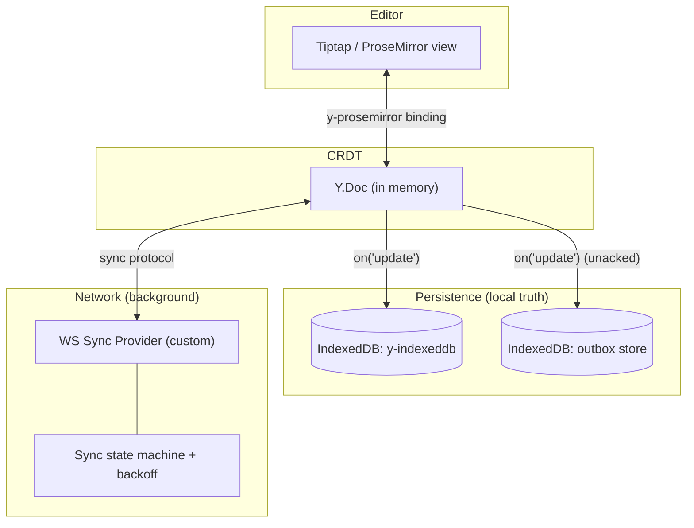
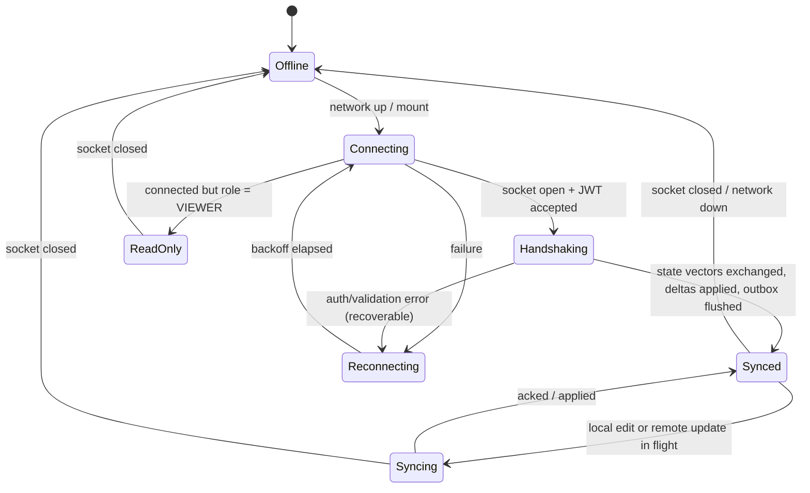
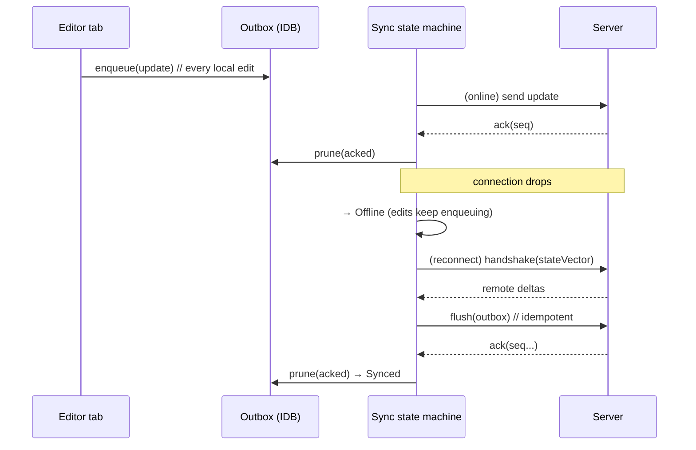

# 05 — Local-First Architecture & Background Sync Engine

This is the heart of the assignment. Two requirements live here:

- **F1 Local-first:** client storage is the _primary source of truth_; open/edit/close with **zero
  network requests blocking the UI**.
- **F2 Background sync:** on reconnect, push local changes and pull remote changes **without
  overwriting or destroying offline work**.

## 1. The local-first contract

> The browser is authoritative for _what the user is doing right now_. The server is authoritative for
> _durability and distribution_. Neither blocks the other.

Concretely:

- Rendering and input **never await the network.** The editor binds to an in-memory `Y.Doc` hydrated
  from IndexedDB. If the network is down at open time, nothing changes for the user.
- Every edit is a Yjs update applied locally and **persisted to IndexedDB synchronously-enough** to
  survive a reload/crash, then queued for the server.
- The network layer is a **background process** that reconciles. It can be slow, flaky, or absent
  without affecting the editing experience.

## 2. Layers in the browser

- **`y-prosemirror`** keeps the editor view and `Y.Doc` in lockstep (local, synchronous).
- **`y-indexeddb`** persists the full doc transparently — instant reload, offline durability.
- **Outbox store** records updates not yet acknowledged by the server, so we can show accurate sync
  status and flush idempotently after reconnect.
- **WS Sync Provider** speaks the Yjs sync protocol to the server; the **state machine** owns
  connect/offline/reconnect/backoff transitions and drives the status indicator.

## 3. Why CRDT makes "no overwrite" almost free — but the _engine_ is still ours

Yjs guarantees that applying updates in any order/any number of times converges (idempotent +
commutative). So a naive "send everything, receive everything on reconnect" already avoids the classic
last-writer-wins overwrite. The engineering we add on top:

1. **Durability before acknowledgement** — persist locally _first_, enqueue in the outbox, _then_
   attempt send. A crash mid-send loses nothing.
2. **Idempotent, bounded flush** — on reconnect, send the outbox; the server applies idempotently and
   acks by `seq`; we prune acked entries. Re-sends after a flaky connection are harmless.
3. **State-vector handshake** — we don't blindly pull the whole doc. We exchange state vectors so each
   side sends only the _delta the other is missing_. O(diff), not O(document).
4. **Origin tagging** — local updates are tagged so the binding doesn't echo remote updates back as
   new local ones (prevents feedback loops).

## 4. The reconnection state machine

- **Exponential backoff with jitter** on `Reconnecting` (e.g. 1s → 2s → 4s … capped, randomized) to
  avoid thundering-herd reconnects after a server blip.
- **`ReadOnly`** is a first-class state: a Viewer connects and receives updates/awareness but the
  editor is non-editable and the provider never sends `update` messages (belt-and-suspenders with the
  server-side rejection in [08](./08-auth-and-rbac.md)/[09](./09-security-and-validation.md)).

## 5. Race conditions we explicitly handle

The brief names "state synchronization race conditions." The concrete ones and our mitigations:

| Race                                              | Symptom if ignored                      | Mitigation                                                                                                          |
| ------------------------------------------------- | --------------------------------------- | ------------------------------------------------------------------------------------------------------------------- |
| **Offline edits vs. concurrent remote edits**     | Lost work / overwrite                   | CRDT commutative merge; both directions reconciled on reconnect                                                     |
| **Reconnect storm / duplicate delivery**          | Same update applied twice, corruption   | Yjs updates are idempotent; outbox dedupes by content; server acks by `seq`                                         |
| **Echo loop** (remote update re-emitted as local) | Infinite growth / cursor jitter         | Origin tagging on transactions; binding ignores own origin                                                          |
| **Snapshot during in-flight edits**               | Inconsistent capture                    | Capture from a consistent `Y.Doc` state + `Y.snapshot`; restore is forward-only (see [07](./07-version-history.md)) |
| **Two tabs, same doc, same browser**              | Divergent local state                   | `y-indexeddb` + a `BroadcastChannel` provider so tabs share updates locally even offline                            |
| **Server restart mid-session**                    | Clients think they're synced but aren't | Heartbeat + state-vector re-handshake on every (re)connect                                                          |
| **Clock skew**                                    | (Would break) timestamp-ordered merges  | We never order by wall-clock; CRDT order is logical (Lamport-style), not time-based                                 |

## 6. What "background sync engine" means concretely (F2)

A small module (`lib/sync/`) that:

1. Owns the WS provider lifecycle and the state machine above.
2. Maintains the **outbox**: append on local update, prune on server ack.
3. Exposes a **`useSyncStatus()`** hook → drives the connection-status indicator (the UI states in
   [02](./02-system-architecture.md) §7).
4. Listens to `navigator.onLine` + socket events + a heartbeat to decide transitions.
5. Triggers **flush** on reconnect and **delta-pull** via the handshake.
6. Surfaces recoverable errors (validation/permission) as UI events without dropping local state.

## 7. PWA / installability (optional polish)

A service worker caches the app shell so the app **opens offline**, not just edits offline. The
document data itself is already in IndexedDB. This turns "works offline" into a believable demo:
airplane-mode reload still launches the editor.

## 8. Edge cases & answers

- **First-ever open of a brand-new doc offline?** Allowed — the doc is created locally with a client
  id; it syncs (and gets reconciled with server metadata) on first connect.
- **Quota exceeded in IndexedDB?** Compact local history (drop superseded updates, keep merged
  state); surface a non-blocking warning. See [11](./11-performance-and-scale.md).
- **User edits as Viewer offline (role downgraded server-side while away)?** Local edits are kept but
  rejected on push; UI explains "you no longer have edit access" and offers to copy the local diff
  into a doc they own. No silent data loss.
- **Massive offline backlog on reconnect?** Flush is chunked and backpressure-aware so we don't blast
  the server or block the UI thread.

## 9. Testability (preview)

The sync engine is built as pure-ish modules with the transport injected, so tests can simulate
offline/online, dropped acks, duplicate delivery, and concurrent peers deterministically. Full plan
in [12-testing-strategy.md](./12-testing-strategy.md) — this is the area the rubric weights most.
