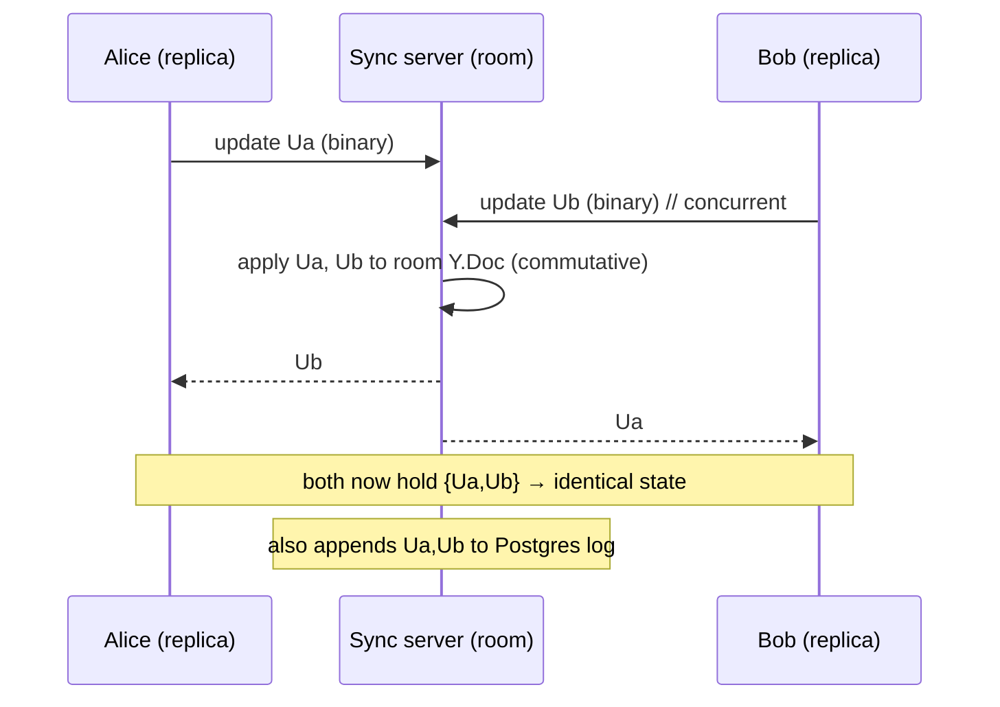

# 06 — Deterministic Conflict Resolution (CRDT internals)

The brief asks for "deterministic conflict resolution merging without data loss" and "complex data
merging algorithms over real-time communication protocols." This doc explains _how_ the merge works,
_why_ it's deterministic, and _why_ it never loses data — at a level that shows we understand the
algorithm we're standing on, not just the library.

## 1. The problem, precisely

Two users edit the _same_ rich-text document concurrently while one or both are offline. There is **no
shared clock and no central referee at edit time**. When their edit streams finally meet, the system
must produce **one document** such that:

1. **Convergence** — every replica ends at the _byte-identical_ same state.
2. **Determinism** — the result depends only on the set of operations, **not** their arrival order or
   timing.
3. **No data loss** — no edit silently disappears (the failure mode of last-writer-wins).
4. **Intention preservation (best-effort)** — the merged text is sensible, not scrambled.

Last-writer-wins (overwrite the whole field with whoever saved last) fails #3 catastrophically. OT
satisfies these but needs a server to transform/order ops. **CRDTs satisfy 1–3 by construction,
offline, with no coordinator.**

## 2. Why a CRDT converges — the intuition

A CRDT is a data type whose merge operation is **commutative, associative, and idempotent**:

```
merge(a, b) == merge(b, a)            // order doesn't matter  → determinism
merge(a, merge(b, c)) == merge(merge(a, b), c)   // grouping doesn't matter
merge(a, a) == a                      // duplicates are harmless → idempotent
```

If merge has these properties, then _any_ replica that has seen the _same set_ of updates computes the
_same_ state — regardless of when each update arrived or how many times. That is the whole magic. Our
sync engine's only job is to make sure every replica eventually sees every update (gossip via the WS
server + state-vector deltas); the _merge_ itself is order-independent.

## 3. How Yjs does it for text (YATA, briefly)

Yjs implements a list/sequence CRDT in the **YATA** family. Key ideas:

- **Unique IDs, not positions.** Every inserted character (item) gets a globally unique id
  `(clientID, clock)` — a per-client Lamport-style counter. Positions are _derived_, never stored, so
  two clients inserting "at position 5" don't collide — each item has its own identity.
- **Insertions reference neighbors.** An item records the ids of the items it was inserted _between_.
  Concurrent inserts at the same spot are ordered by a **deterministic tie-break** (by `clientID`),
  giving every replica the same final sequence.
- **Deletions are tombstones.** Deleting doesn't remove the item; it flags it deleted (a _delete set_).
  This is what guarantees **no data loss on concurrent edit-vs-delete** and lets us reconstruct any
  past state. (It's also why documents grow — addressed in [11](./11-performance-and-scale.md).)
- **State vectors.** Each replica summarizes "I have seen up to clock N from each client" as a state
  vector. Diffing two state vectors yields exactly the missing operations — the basis of efficient
  sync ([05](./05-local-first-and-sync-engine.md) §3).

### Worked example — the classic conflict

Document is `Hi`. Both users go offline.

- **Alice** inserts `!` after `Hi` → `Hi!`
- **Bob** deletes `i` and inserts `ey` → `Hey`

Naive LWW: one of these whole results wins; the other's work is gone.

Yjs: Alice's `!` is an item with id `(A, 1)` placed after the `i` item. Bob's delete tombstones the
`i` item; his `ey` are items `(B, 1),(B, 2)`. On merge, **all** items exist; tombstoned ones are
hidden; the visible sequence is deterministically ordered by neighbor refs + clientID tie-break. Both
replicas converge to the same result (e.g. `Hey!`), and **no keystroke was discarded** — Alice's `!`
and Bob's `ey` both survive. That's "merging without data loss," concretely.

## 4. Rich text, not just characters

We edit through ProseMirror (Tiptap), so the CRDT must merge **structured** content — marks (bold,
italic), block types (headings, lists), not just a character array. `y-prosemirror` maps the
ProseMirror document to Yjs shared types (`Y.XmlFragment` / `Y.XmlElement` / `Y.XmlText`). Concurrent
operations like "Alice bolds a word" while "Bob deletes the sentence containing it" merge at the
shared-type level with the same convergence guarantees. This is the genuinely "complex" merge the
brief is asking for — and it's why a rich-text editor (not a textarea) is the right demo.

## 5. Determinism across the wire (the "over a real-time protocol" part)

The merge is local and order-independent; the **protocol** just has to deliver updates reliably and
let replicas discover what they're missing:



Even if Bob is offline when Alice sends, the server holds Alice's update; on Bob's reconnect handshake
he requests the delta his state vector is missing and receives `Ua`. Symmetrically for Bob's. **No
update is ordered by time; convergence is by op set.**

## 6. Awareness (presence) — explicitly _not_ part of the merged document

Cursors, selections, and user color/name are **ephemeral awareness state**, kept in a separate Yjs
awareness CRDT that is _not_ persisted into the document or the update log. This keeps presence
churn out of the durable history and lets Viewers participate in presence without writing document
state (M3). Awareness is last-write-wins per client and times out when a client disconnects.

## 7. Guarantees we can state plainly (and demo)

- **No "resolve conflict" dialog ever appears.** Merges are automatic and deterministic.
- **Two offline editors of the same paragraph both keep their work** after reconnect.
- **Replaying the same update twice changes nothing** (idempotent) — survives flaky networks.
- **The same set of edits always yields the same document**, on every device, every time.

## 8. Honest limits (and how we frame them)

- **Semantic conflicts aren't "resolved," they're _merged_.** If Alice and Bob both rewrite the same
  sentence differently, CRDT keeps both interleaved — convergent and lossless, but possibly not what
  either _meant_. This is inherent to conflict-free merging; the mitigation is the **version history**
  (snapshot before a big rewrite, restore if the merge reads badly — [07](./07-version-history.md)) and
  an optional **AI merge-explanation** that summarizes what changed ([10](./10-ai-features.md)).
- **CRDT metadata grows.** Addressed by GC/compaction/snapshots — [11](./11-performance-and-scale.md).
- **Yjs gives us the algorithm; correctness of _our_ integration\* is what we test** — merge-invariant
  property tests (random concurrent op sets must converge) are in [12](./12-testing-strategy.md).
