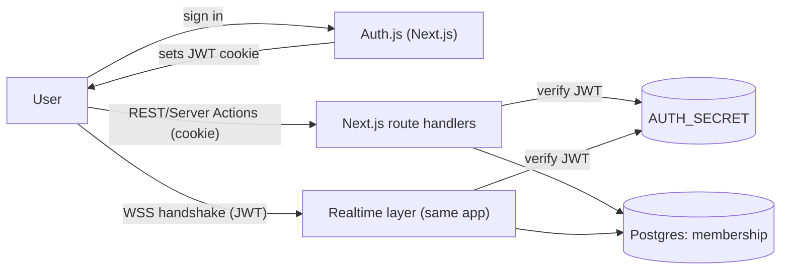
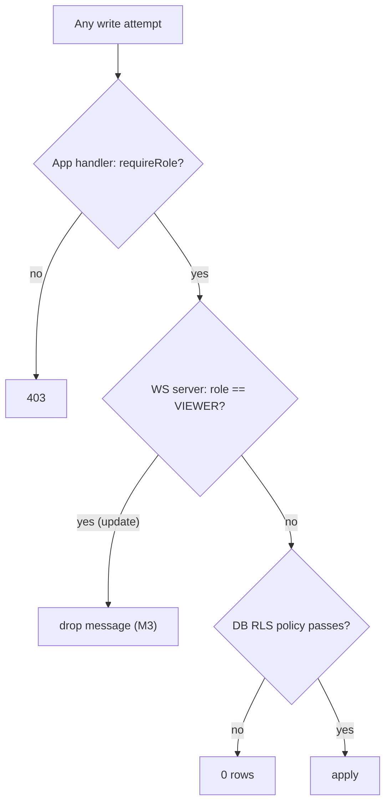

# 08 — Authentication & Authorization (RBAC)

Covers M1 (auth), M2 (Owner/Editor/Viewer), M3 (**Viewers cannot push to the realtime server**), and
the authorization half of M5 (tenant isolation). Security/validation specifics are in
[09](./09-security-and-validation.md).

## 1. Authentication — Auth.js (NextAuth v5), JWT sessions

- **Provider:** email magic-link and/or OAuth (GitHub/Google) via Auth.js, plus an optional
  credentials provider for the demo.
- **Session strategy: JWT.** Chosen specifically because the **realtime layer authenticates the same
  user on the WebSocket upgrade** — it verifies the JWT statelessly with `AUTH_SECRET` (same process as
  the HTTP routes; no second session store, and it stays cheap if the realtime layer is ever split out).
- **Adapter:** Prisma adapter (User/Account/Session/VerificationToken tables in [04](./04-data-model.md)).
- **Token contents:** `sub` (userId), `email`, `name`, short expiry; **no roles baked in** (roles are
  per-document and can change, so they're looked up live — see §4).



## 2. The role model

Roles are **per document**, stored in `DocumentMembership(documentId, userId, role)`:

| Role       | Read | Edit (push CRDT updates) | Manage versions (restore) | Manage members / delete doc |
| ---------- | :--: | :----------------------: | :-----------------------: | :-------------------------: |
| **Owner**  |  ✅  |            ✅            |            ✅             |             ✅              |
| **Editor** |  ✅  |            ✅            |            ✅             |             ❌              |
| **Viewer** |  ✅  |   ❌ (awareness only)    |     ❌ (preview only)     |             ❌              |

A user can own some documents and be a viewer on others. There is no global "admin" — authorization
is always scoped to a `(user, document)` pair.

## 3. Authorization is enforced in **three** places (defense in depth)

The same rule must hold no matter which entry point is used:

1. **REST Route Handlers / Server Actions** (Next.js) — every handler resolves the membership for the
   authenticated user before doing anything. A scoped helper is the only sanctioned data path:

   ```ts
   // lib/auth/guards.ts (sketch)
   async function requireRole(userId: string, docId: string, min: Role) {
     const m = await prisma.documentMembership.findUnique({
       where: { documentId_userId: { documentId: docId, userId } }
     })
     if (!m || rank(m.role) < rank(min)) throw new ForbiddenError()
     return m.role
   }
   // usage: const role = await requireRole(session.user.id, docId, "EDITOR")
   ```

2. **The realtime layer** (inside the Next.js custom server) — **this is M3.** On socket connect:
   - verify JWT → get `userId`;
   - load the membership for `(userId, docId)`;
   - if none → **reject the connection**;
   - if `VIEWER` → mark the connection **read-only**: the server **drops any inbound `sync`/`update`
     message** from it (logs + optionally closes on repeated attempts) and only forwards
     awareness/presence. Editors/Owners may push.

   ```ts
   // lib/realtime — on message (sketch)
   if (conn.role === 'VIEWER' && isDocumentUpdate(msg)) {
     metrics.rejectedViewerWrite.inc()
     return // never apply, never broadcast, never persist
   }
   ```

   The client _also_ refuses to send as a Viewer (UI is read-only), but the server is the **trust
   boundary** — a tampered client cannot bypass it.

3. **Postgres (optional RLS)** — last line: row-level policies keyed on a session GUC so even a buggy
   query can't cross tenants. See [09](./09-security-and-validation.md) §RLS.



## 4. Why roles aren't in the JWT

Roles can change (Owner demotes an Editor to Viewer, revokes access) and are per-document. Baking them
into a long-lived JWT would make revocation slow and the token huge. Instead:

- JWT carries **identity only**;
- **role is resolved live** from `DocumentMembership` at the point of action (handler + WS connect),
- with a tiny per-connection cache in the WS server, invalidated on membership-change events.

This means **revocation takes effect on the next action / reconnect**, and a Viewer downgraded mid-
session stops being able to push as soon as the server re-checks (we re-validate on each update for
Viewers, cheaply, since the check is a cached lookup).

## 5. Sharing & membership management

- Owner can invite by email → creates a `DocumentMembership` with a chosen role.
- Owner can change roles or revoke; revocation deletes the membership (cascade-safe).
- Changing someone to Viewer mid-session triggers a membership-change signal so the WS server flips
  that connection to read-only without a full reconnect.

## 6. Threats this addresses (auth-specific; see [09] for payload/DoS)

| Threat                                           | Defense                                                                    |
| ------------------------------------------------ | -------------------------------------------------------------------------- |
| Unauthenticated socket connect                   | JWT required in handshake; rejected otherwise                              |
| Viewer pushing edits via a hacked client         | Server drops Viewer update messages (M3), regardless of client             |
| Accessing another tenant's doc by guessing an id | Every query scoped by membership; RLS backstop                             |
| Privilege escalation via stale token role        | Roles not in token; resolved live from DB                                  |
| Forged JWT                                       | Signature verified with `AUTH_SECRET` on both the HTTP and WebSocket paths |
| IDOR on version restore                          | Restore endpoint calls `requireRole(..., EDITOR)` before delegating        |

## 7. Accessibility & UX of permissions

- Viewer sees a clear **"View only"** lock state ([02](./02-system-architecture.md) §7), disabled
  toolbar, and a tooltip explaining why.
- Permission errors surface as actionable toasts, not silent failures.
- Restore/manage actions are hidden (not just disabled) for roles that lack them, and also enforced
  server-side (never trust the hidden UI).
