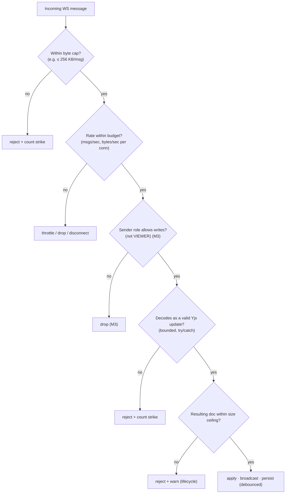

# 09 — Security, Validation & Tenant Isolation

Covers F4 (robust validation), M4 (**prevent malformed/oversized payloads from OOMing the server**),
and M5 (secure API routes + RLS / strict ORM scoping). The brief explicitly asks us to _discuss
mitigation strategies and contingency plans_ — so this doc is part design, part threat model.

## 1. Threat model (STRIDE-ish, scoped to this app)

| Threat                    | Vector                         | Mitigation                                                                                  | Req |
| ------------------------- | ------------------------------ | ------------------------------------------------------------------------------------------- | --- |
| **DoS / OOM**             | Giant or flooded sync payloads | Size caps, rate limits, bounded decode, backpressure, per-room memory ceiling               | M4  |
| **Corruption**            | Malformed binary "update"      | Validate structure + decode in try/catch _before_ apply; reject bad updates                 | F4  |
| **Tenant breach**         | IDOR, missing scope            | Scoped ORM helpers + optional Postgres RLS                                                  | M5  |
| **Privilege escalation**  | Viewer pushing edits           | Server-side role enforcement (M3)                                                           | M3  |
| **Injection**             | Malicious doc content rendered | ProseMirror schema sanitizes; React escapes; CSP                                            | F4  |
| **Token theft / forgery** | Stolen/forged JWT              | HttpOnly+Secure cookies, short TTL, signature verified on both the HTTP and WebSocket paths | M1  |
| **Abuse of AI endpoints** | Prompt cost bombs              | Auth + per-user rate limit + input/output token caps                                        | F6  |

## 2. The headline: preventing a malformed/oversized payload from OOMing the server (M4)

The assignment poses this directly. Layered defenses, **cheapest checks first** so an attacker is
rejected before doing expensive work:



Concrete controls:

1. **Hard message-size cap.** The WebSocket server sets `maxPayload` (e.g. **256 KB**) at the socket
   level so oversized frames are rejected by the transport **before allocation** — the single most
   important OOM guard. Legitimate Yjs updates are tiny (keystrokes are bytes); a 256 KB cap is
   generous.
2. **Per-connection rate limiting.** Token-bucket on **messages/sec** and **bytes/sec**. Exceeding it
   throttles, then disconnects repeat offenders. Stops flood-based memory pressure even if each
   message is small.
3. **Bounded, defensive decode.** Decode the update inside `try/catch`; reject anything that doesn't
   parse as a well-formed Yjs update. Never call `applyUpdate` on unvalidated bytes. (Apply to a
   _scratch_ doc / or rely on Yjs's structured decode which throws on malformed input → caught.)
4. **Per-document state ceiling.** Cap the materialized doc size; if an update would push a document
   past the ceiling, reject and surface a "document too large — split or archive" path. Prevents a
   slow-drip OOM and ties into lifecycle ([11](./11-performance-and-scale.md)).
5. **Per-room and per-process memory budget.** Rooms are LRU-evicted/persisted when idle; a global cap
   on concurrent in-memory docs prevents one process from holding unbounded rooms. Backpressure on
   slow clients (bounded send queues; drop laggards rather than buffer infinitely).
6. **Connection caps.** Max sockets per user and per IP; max rooms joined per connection.
7. **Strike/ban.** Repeated oversize/malformed messages from a connection → disconnect and temporary
   ban, logged with the `userId`.

> **Contingency plan (asked for by the brief):** if a room's memory or message rate crosses an alarm
> threshold, the server (a) sheds the offending connection, (b) force-compacts the room to a snapshot,
> (c) emits a metric/alert, and (d) can quarantine the document (read-only) until inspected — so one
> abusive document can't take down collaboration for everyone. Horizontal isolation (one bad room ≠
> whole service) comes from per-room budgets + the scaling shard model in [11](./11-performance-and-scale.md).

## 3. REST / Server Action validation (F4)

- **Zod schemas at every boundary.** Bodies, params, and query strings are parsed with Zod; failures
  → `400` with a safe error shape. Schemas live in a shared package so the **WS server and the app use
  the same validators**.
- **Body size limits** on route handlers (reject large JSON early).
- **No mass-assignment:** only whitelisted fields from validated input ever reach Prisma.
- **Output encoding:** API returns typed DTOs, never raw Prisma rows with extra fields.

```ts
// shared/validators.ts (sketch)
export const CreateSnapshot = z.object({
  documentId: z.string().cuid(),
  label: z.string().min(1).max(120)
})
export const RestoreVersion = z.object({ snapshotId: z.string().cuid() })
```

## 4. Tenant isolation (M5) — two layers

### Layer 1 — strict ORM scoping (primary)

- **Every** document/version/membership query goes through a helper that joins
  `DocumentMembership` for the authenticated `userId`. There is no code path that fetches a document by
  id without a membership predicate.
- Lint rule / code-review convention forbids `prisma.document.findUnique({ where: { id } })` in app
  code; the sanctioned API is `getDocumentForUser(userId, id)`.

### Layer 2 — PostgreSQL Row-Level Security (defense in depth)

Even if app code slips, the database refuses cross-tenant rows. We set a per-request session variable
and write policies against it:

```sql
ALTER TABLE "Document" ENABLE ROW LEVEL SECURITY;

CREATE POLICY doc_access ON "Document"
  USING (
    EXISTS (
      SELECT 1 FROM "DocumentMembership" m
      WHERE m."documentId" = "Document".id
        AND m."userId" = current_setting('app.user_id', true)
    )
  );
-- App sets: SET LOCAL app.user_id = '<authenticated userId>'  (per transaction)
```

Trade-off noted: RLS with Prisma requires running queries inside a transaction that sets the GUC (via
a Prisma extension/middleware or driver adapter). We treat RLS as a **backstop**, with scoped helpers
as the everyday mechanism — the brief explicitly accepts "**RLS or strict ORM scoping**," and we do
both.

## 5. Transport & app-level hardening

- **HTTPS/WSS only**; HSTS.
- **Auth cookies:** `HttpOnly`, `Secure`, `SameSite=Lax`; CSRF protection on state-changing routes
  (Auth.js handles its own; Server Actions get origin checks).
- **CSP** restricting script/connect sources (allow the WS origin), `frame-ancestors 'none'`,
  `X-Content-Type-Options: nosniff`.
- **Secrets** only in env (`AUTH_SECRET`, `DATABASE_URL`, AI keys); never in the client bundle; the AI
  provider key lives **only** on the server — AI calls are proxied through Next.js routes.
- **CORS** on REST/AI routes limited to the app origin; the WS server checks `Origin` on upgrade.

## 6. Content & XSS safety

- ProseMirror enforces a **schema** — only allowed nodes/marks survive; pasted HTML is sanitized to
  that schema, so stored document content can't carry script.
- React escapes by default; we never `dangerouslySetInnerHTML` document content.
- AI output rendered as text/markdown through a sanitizer, never as raw HTML.

## 7. Observability for security

- Structured logs with `userId`/`documentId`/`connId` on every rejection (size, rate, role, decode).
- Metrics: rejected-viewer-writes, oversize-rejects, decode-failures, room memory, active rooms,
  reconnect rate. Alarms on anomalies.
- (Production extension) Sentry for errors; rate-limit + WAF at the edge.

## 8. What we explicitly say in the README/repo (the brief wants the _discussion_)

A short "Security" section in the repo README will summarize: the OOM defense ladder (§2), the
validate-before-apply rule (§3), the two-layer tenant isolation (§4), and the contingency plan for a
hot/abusive document (§2 callout). This doc is the long form.
