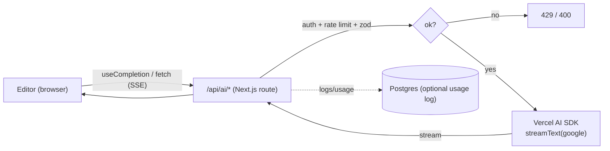

# 10 — AI Add-On Features

Requirement F6 / Good-to-Have: "leverage AI for add-on features." The brief's list is **"AI-SDK,
OpenAI, Gemini or Groq."** We use the **Vercel AI SDK** (`ai` + `@ai-sdk/google`) with **Google
Gemini** — both literally on the PDF list — streaming, behind a provider abstraction so another
PDF-listed provider (Groq for ultra-low-latency inline; OpenAI) can be swapped per-feature. (Claude is
deliberately not used, to follow the PDF exactly.)

Crucially, the AI features are chosen to **reinforce the core thesis** (local-first collaboration +
version control), not bolt on a generic chatbot.

## 1. Feature set (mapped to where they add real value)

| Feature                               | What it does                                                                | Model        | Surface                                          |
| ------------------------------------- | --------------------------------------------------------------------------- | ------------ | ------------------------------------------------ |
| **Inline writing assist**             | Ghost-text continuation / "improve this selection" / fix grammar            | Gemini Flash | Editor (selection menu, ⌘↵)                      |
| **Document summarization**            | TL;DR / abstract / action-items for the current doc                         | Gemini Pro   | Doc menu, streamed panel                         |
| **AI version-diff explanation**       | Natural-language "what changed between version A and B"                     | Gemini Pro   | Version timeline ([07](./07-version-history.md)) |
| **Semantic snapshot naming**          | Auto-label a manual snapshot from its diff ("Rewrote intro, added pricing") | Gemini Flash | On "Save version"                                |
| **Merge-aware summary** _(optional)_  | After a big concurrent merge, summarize how the doc changed                 | Gemini Pro   | Toast/panel after sync                           |
| **Ask-the-document Q&A** _(optional)_ | Grounded Q&A over the doc content                                           | Gemini Pro   | Side panel                                       |

The **version-diff explanation** and **merge-aware summary** are the differentiated ones — they turn
the otherwise-invisible CRDT/version machinery into something a user understands ("your offline edits
and Sam's edits both merged; here's the net change"). That's AI used to _explain a distributed system_,
which fits the assignment's ambition.

## 2. Model choice & cost

Provider: **Google Gemini** via `@ai-sdk/google`. Use the **latest model IDs at build time** (confirm
against the Google AI provider docs — the family roles below are what matter):

| Tier                                | Model (family)               | Role here                                              |
| ----------------------------------- | ---------------------------- | ------------------------------------------------------ |
| **Flash** (e.g. `gemini-2.5-flash`) | fast, cheap                  | Latency/cost-sensitive: inline assist, snapshot naming |
| **Pro** (e.g. `gemini-2.5-pro`)     | higher quality, long context | Summaries, version-diff explanations, Q&A              |

Rationale: inline assist must feel instant and runs often → **Flash**. Summaries/diffs are less
frequent and benefit from quality + large context → **Pro**. Gemini has a **generous free tier** (ideal
for the demo) and low per-token cost on Flash; exact pricing to be confirmed at build time. Groq and
OpenAI remain swap-in options behind the same AI-SDK interface (all PDF-listed).

> **API hygiene:** all model calls go through the Vercel AI SDK's Google provider with **streaming**
> (`streamText`) so long outputs don't hit request timeouts and the UI shows tokens as they arrive. The
> provider key lives **only on the server** (AI routes proxy every call).

## 3. Architecture — AI calls are server-proxied



- The browser **never** holds the AI key; it calls our `/api/ai/*` routes.
- Each route: **authenticate** the user → **authorize** (must have access to the doc) → **rate limit**
  per user → **validate** input (Zod, size caps) → **stream** the model response back via SSE.
- Document content is sent as context **only for docs the user can access** (no cross-tenant leakage).

## 4. Example endpoints

```ts
// app/api/ai/summarize/route.ts (sketch)
export async function POST(req: Request) {
  const { user } = await requireSession(req)
  const { documentId } = Summarize.parse(await req.json()) // zod + size cap
  await requireRole(user.id, documentId, 'VIEWER') // access check
  await aiRateLimiter.check(user.id) // per-user budget
  const text = await getPlainText(documentId, user.id) // scoped fetch
  const result = streamText({
    model: google('gemini-2.5-pro'), // confirm latest ID at build time
    system: 'Summarize the document faithfully. No invented facts.',
    prompt: text,
    maxOutputTokens: 1024
  })
  return result.toUIMessageStreamResponse()
}
```

```ts
// app/api/ai/diff/route.ts  — explain what changed between two versions
//   load snapshot A and B (scoped), compute a textual diff, ask the model to
//   describe the change set in plain language; stream the explanation.
```

## 5. Prompts & guardrails

- **System prompts** constrain to faithful, grounded output ("summarize only what's present; do not
  invent"). For diff explanation we feed the _computed_ diff, not raw docs, so the model describes real
  changes.
- **Output caps** (`maxOutputTokens`) on every call to bound cost and latency.
- **Input caps**: large docs are truncated/section-summarized (map-reduce) rather than silently cut;
  the user is told if a doc was too large.
- **No secrets/PII to the model** beyond document content the user already owns.

## 6. Cost & abuse control

- **Tiered models** (Gemini Flash for frequent, Pro for occasional).
- **Per-user rate limits** + **monthly token budget** with graceful degradation ("AI assist paused").
- **Debounce** inline assist (don't fire on every keystroke; trigger on pause/explicit command).
- **Caching**: identical summarize requests on an unchanged doc can return a cached result
  (key = docId + content hash) to avoid repeat spend.
- **Feature flags** so AI can be disabled entirely (e.g. if no key configured) without breaking the
  app — AI is strictly additive to the core local-first experience.

## 7. UX & accessibility

- AI panels stream tokens with a visible "generating…" state and a stop button.
- Inline suggestions are clearly distinguished (ghost text), accepted with a keystroke, never
  auto-applied.
- All AI output is **suggested, never silently merged** into the shared CRDT — the user accepts it,
  which then becomes a normal local edit and syncs like any other (keeps the local-first/merge model
  intact).
- Errors degrade gracefully (the editor works fine without AI).

## 8. Why this is "AI used well," not "AI bolted on"

The standout features (**version-diff explanation**, **merge-aware summary**, **semantic snapshot
naming**) make the _distributed-systems_ work legible to humans — they explain merges and versions in
natural language. That's a competitive-edge use of AI that's native to this product, exactly the spirit
of the brief.
