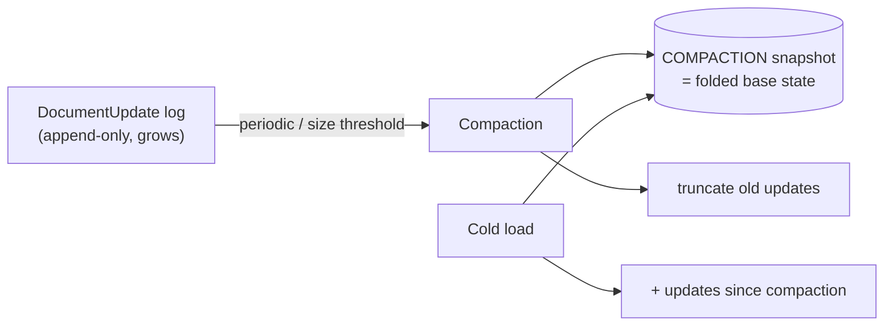
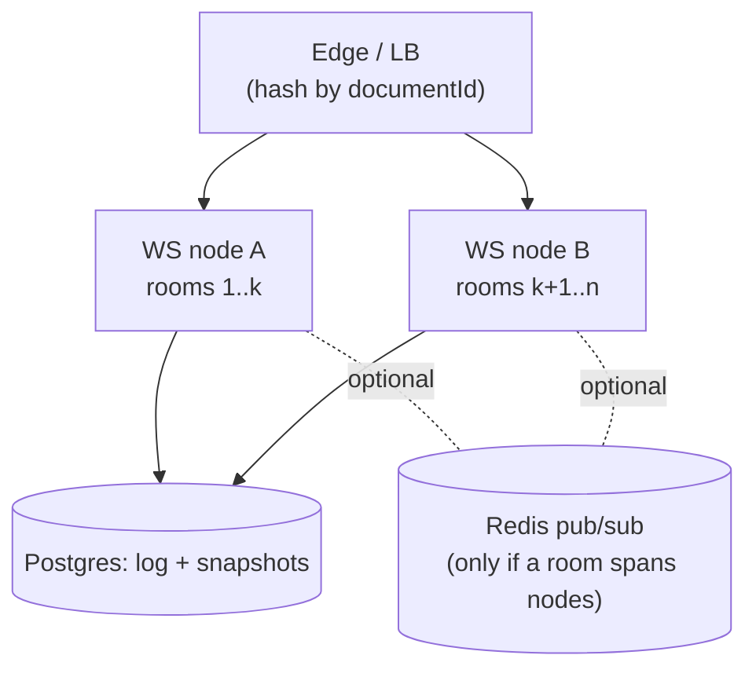

# 11 — Performance, Memory & Scale

This doc answers three things the rubric weights: **no client-side lag during rapid typing** (E3),
**document state size over time** (E6, the named "real-world" challenge), and **scaling** the
collaboration tier (F9).

## 1. No lag during rapid typing (the explicit Code-Quality criterion)

The local-first design already removes the biggest source of lag: **input never waits on the network**
(edits apply to the in-memory `Y.Doc` synchronously). On top of that:

| Technique                               | What it prevents                                                                                                               |
| --------------------------------------- | ------------------------------------------------------------------------------------------------------------------------------ |
| **Edits are local & synchronous**       | Network/DB latency never touches the keystroke path                                                                            |
| **Debounced IndexedDB writes**          | Persisting on _every_ keystroke causing jank — batch via `requestIdleCallback`/short debounce; `y-indexeddb` already coalesces |
| **Debounced/coalesced network sends**   | Flooding the socket per keystroke — batch updates over a small window                                                          |
| **Throttled awareness**                 | Cursor/presence spam dominating the channel — throttle awareness to ~20–30/s                                                   |
| **Throttled server persistence**        | A DB write per keystroke — server debounces the append + periodic compaction                                                   |
| **Editor virtualization for huge docs** | ProseMirror re-render cost on large documents                                                                                  |
| **Memoized React + transitions**        | Re-rendering the whole tree on each keystroke — `useTransition`, granular memoization, keep the editor subtree isolated        |
| **Web Worker option**                   | Heavy CRDT/diff/snapshot work blocking the main thread — move it off-thread if profiling shows jank                            |

**Measurement, not vibes:** we set budgets — input latency p95 < ~16 ms (one frame), no long tasks

> 50 ms during sustained typing — and verify with the Performance panel / `PerformanceObserver` and a
> scripted "type 5,000 chars fast" test. (E2E typing-latency check noted in [12](./12-testing-strategy.md).)

## 2. Document state size over time (the named real-world challenge)

CRDTs keep tombstones and per-character metadata, and an append-only update log grows forever. Left
alone, cold loads slow down and memory balloons. Our lifecycle:

Levers:

1. **Compaction.** Periodically fold the update log into a single base state
   (`Y.encodeStateAsUpdate`) stored as a `COMPACTION` snapshot, then truncate superseded updates. Cold
   load = base + recent deltas = **O(recent), not O(history)** ([04](./04-data-model.md) §3.1).
2. **Yjs garbage collection.** Enable Yjs GC so fully-deleted ranges shed their content (keeping just
   the minimal tombstone), shrinking the live doc — balanced against keeping enough for version
   previews (we snapshot _before_ GC-sensitive operations).
3. **Snapshot thinning.** Keep all manual versions; coarsen old auto-snapshots (hourly → daily) so the
   timeline and storage stay bounded ([07](./07-version-history.md) §7).
4. **Client-side compaction.** IndexedDB also coalesces; on quota pressure we drop superseded local
   updates and keep the merged state, with a non-blocking warning.
5. **Big-blob offload (scaling path).** Very large snapshot blobs can move from Postgres `bytea` to
   object storage (S3/R2) with a pointer row — noted, not needed for the deliverable.
6. **Archive / fork.** For pathologically long-lived docs, offer "archive history" (snapshot + reset
   the live log) or "fork to a new document," bounding any single doc's working set.

> This is the section that most directly answers E6 — and it's a _consequence we designed for_, not an
> afterthought: we chose a CRDT knowing the tombstone cost and built compaction/snapshots to pay it
> down.

## 3. Caching & code-splitting (E3 / F8)

- **Editor is client-only and dynamically imported** (`next/dynamic`, `ssr:false`) — ProseMirror/Yjs
  don't run on the server and shouldn't bloat the initial payload of other routes.
- **SSR** for the documents list (fast first paint, SEO-irrelevant but snappy);
  **SSG** for marketing pages.
- **Route-segment caching** and React Server Components keep data fetching on the server where it
  helps; the editor route ships minimal JS until the editor chunk loads.
- **HTTP caching** for static assets; **stale-while-revalidate** where appropriate.
- **Prisma connection pooling** (PgBouncer / driver adapter) to survive serverless concurrency.

## 4. Scaling the realtime tier

The WS server is the stateful bottleneck. Path from "works" to "scales":

| Stage                        | Approach                                                                                                                                                   |
| ---------------------------- | ---------------------------------------------------------------------------------------------------------------------------------------------------------- |
| **Deliverable**              | Single WS instance; per-room in-memory doc; honest about the ceiling                                                                                       |
| **Vertical**                 | Bigger instance; per-room + per-process memory budgets; LRU room eviction to Postgres when idle                                                            |
| **Horizontal (sharded)**     | Route each `documentId` to a specific instance (consistent hashing / sticky routing) so a room lives on one node — no cross-node shared mutable doc needed |
| **Multi-instance same room** | If a room must span nodes, add **Redis pub/sub** to fan out updates between instances holding that room; Postgres remains the durable log                  |
| **Load shedding**            | Connection/room caps, backpressure, drop laggards, quarantine abusive rooms ([09](./09-security-and-validation.md))                                        |

Because rooms are sharded by document id, the simple model (one room → one node) scales a long way
without cross-node coordination — most documents have a handful of concurrent editors.

## 5. Memory management in the browser (the brief's first named hard problem)

- **One `Y.Doc` per open document**, destroyed on route away (`doc.destroy()`), providers cleaned up —
  no leaked subscriptions or sockets.
- **Bounded local history** via compaction so a heavily-edited doc doesn't exhaust IndexedDB quota.
- **Awareness cleanup** on disconnect; avoid retaining cursor data for departed peers.
- **Single editor instance**; preview/version views use detached, disposable docs.
- **Profiling discipline:** watch for detached DOM nodes and growing heaps across open/close cycles in
  tests.

## 6. Performance budgets (targets we hold ourselves to)

| Metric                                 | Budget                      |
| -------------------------------------- | --------------------------- |
| Keystroke → on-screen (p95)            | < 16 ms (1 frame)           |
| Long tasks during sustained typing     | none > 50 ms                |
| Cold document open (warm cache)        | < 300 ms to interactive     |
| Reconnect → resynced (typical backlog) | < 1 s                       |
| Initial route JS (non-editor)          | minimal; editor lazy-loaded |

These budgets are checked in CI where feasible (bundle-size check, a Playwright typing-latency probe)
— see [12-testing-strategy.md](./12-testing-strategy.md).
