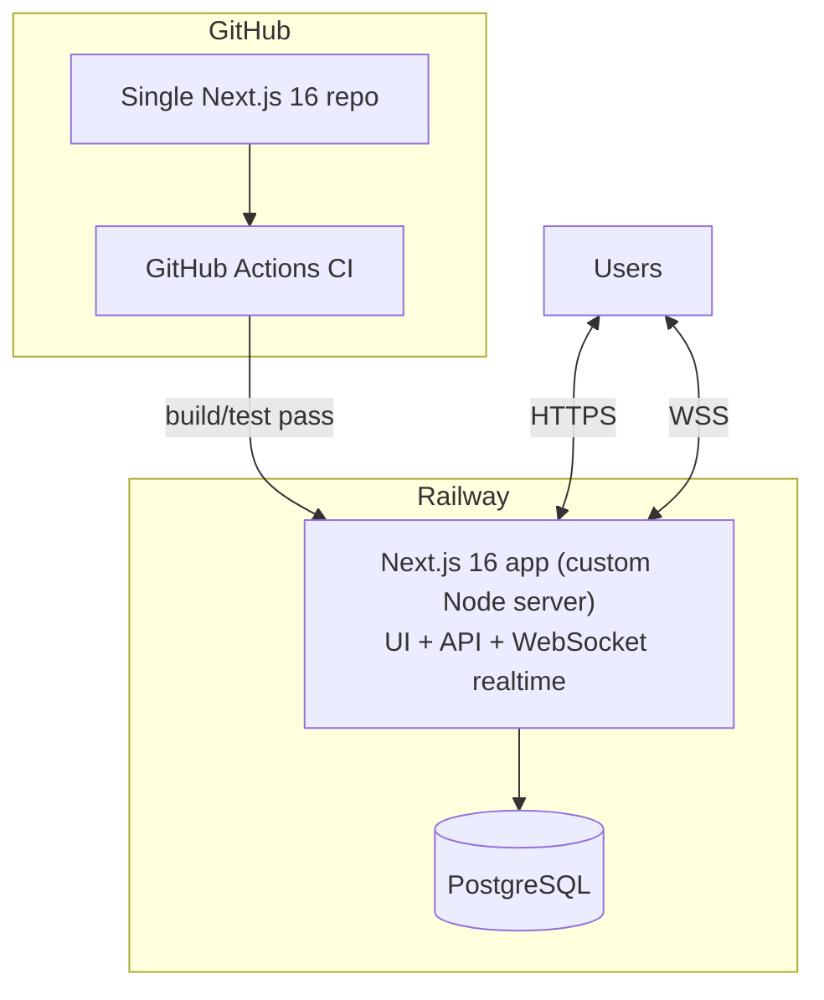
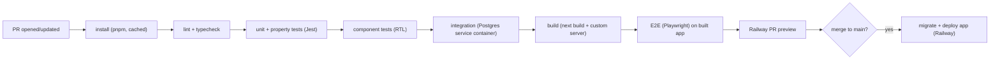

# 13 — Deployment & CI/CD

Requirement F7 + E5. Per the PDF's **"Backend/Frontend: Next.js 16"** mandate, the deliverable is a
**single Next.js 16 application** (frontend + backend + realtime WebSocket via a custom server) plus
PostgreSQL — see [02](./02-system-architecture.md), [03](./03-tech-stack-decisions.md) ADR-4, and
[16](./16-pdf-compliance-audit.md) Decision 1.

## 1. Topology

| Component                            | Host                           | Why                                                                                                          |
| ------------------------------------ | ------------------------------ | ------------------------------------------------------------------------------------------------------------ |
| Next.js 16 app (UI + API + realtime) | **Railway**                    | One Next.js app with a custom Node server holds long-lived WebSockets + per-room CRDT state; a single deploy |
| PostgreSQL                           | **Railway** (or Neon/Supabase) | Managed Postgres co-located with the app; pooled connection                                                  |

> **Why not Vercel?** Vercel serverless can't hold a persistent WebSocket, and the PDF mandates the
> backend be Next.js 16 (so we don't split out a separate socket service). A custom-server Next.js app
> therefore runs on a persistent host. **Railway** is in the JD's cloud list; Render/Fly.io/a small AWS
> instance are equivalent alternatives. The PDF names Vercel/Netlify only as examples ("e.g.").

## 2. Environments

| Env            | Trigger         | URL                    | Data                |
| -------------- | --------------- | ---------------------- | ------------------- |
| **Preview**    | every PR        | Railway PR environment | throwaway/seeded DB |
| **Production** | merge to `main` | stable Railway domain  | production Postgres |

Railway supports per-PR ephemeral environments, so previews still work with one app.

## 3. Configuration / secrets

Set per environment in Railway (never committed):

| Var                                           | Notes                                                                                |
| --------------------------------------------- | ------------------------------------------------------------------------------------ |
| `DATABASE_URL`                                | Pooled URL for the app; direct URL for migrations                                    |
| `AUTH_SECRET`                                 | Auth.js JWT signing/verification (HTTP **and** the WebSocket upgrade — same process) |
| `NEXT_PUBLIC_WS_URL`                          | WSS origin the browser connects to (the app's own domain)                            |
| `AUTH_GITHUB_ID` / `AUTH_GITHUB_SECRET`, etc. | OAuth providers                                                                      |
| `GOOGLE_GENERATIVE_AI_API_KEY`                | Gemini via `@ai-sdk/google`; **server only**, never in the client bundle             |
| `WS_MAX_PAYLOAD`, rate-limit knobs            | OOM/abuse guards ([09](./09-security-and-validation.md))                             |

A `.env.example` documents every variable; the README explains local setup.

## 4. CI/CD pipeline (GitHub Actions)

Stages:

1. **Install** — pnpm with cache.
2. **Static** — ESLint, `tsc --noEmit`, Prettier check.
3. **Tests** — **Jest** unit/property/component (+ RTL); integration with a Postgres **service
   container**; **Playwright** E2E against the built app (the offline-sync scenarios from
   [12](./12-testing-strategy.md)).
4. **Build** — `next build` + bundle the custom server; **bundle-size check** as a soft gate
   ([11](./11-performance-and-scale.md)).
5. **DB migrations** — `prisma migrate deploy` on production deploy (and against the preview DB).
6. **Deploy** — Railway deploys the app from the green commit; per-PR preview environments build
   automatically.
7. **Gates** — merge blocked unless lint + typecheck + tests pass.

## 5. Migrations & zero-surprise releases

- Migrations are checked in; `migrate deploy` runs in CI before the app serves the new schema.
- Backward-compatible migration discipline (expand-then-contract) so a deploy never breaks in-flight
  clients.
- Seed script provisions the Owner/Editor/Viewer demo doc (also used by E2E).

## 6. Observability in production (lightweight but real)

- **Health check**: `/healthz` route + a metrics endpoint for room/memory/reject counters from
  [09](./09-security-and-validation.md).
- **Error tracking**: Sentry — optional, wired behind env.
- **Logs**: structured JSON with `userId`/`documentId`/`connId`.
- **Uptime**: Railway built-in + an external ping on `/healthz`.

## 7. Rollback

- Railway keeps prior deployments → redeploy a previous build/commit to roll back.
- DB rollbacks avoided by forward-compatible migrations; destructive changes are two-phase.

## 8. Cost posture

- A single Railway service + a managed Postgres (Railway/Neon/Supabase free or low tier) is sufficient
  for the deliverable and the demo. AI cost is bounded by Gemini's free tier + the controls in
  [10](./10-ai-features.md).
