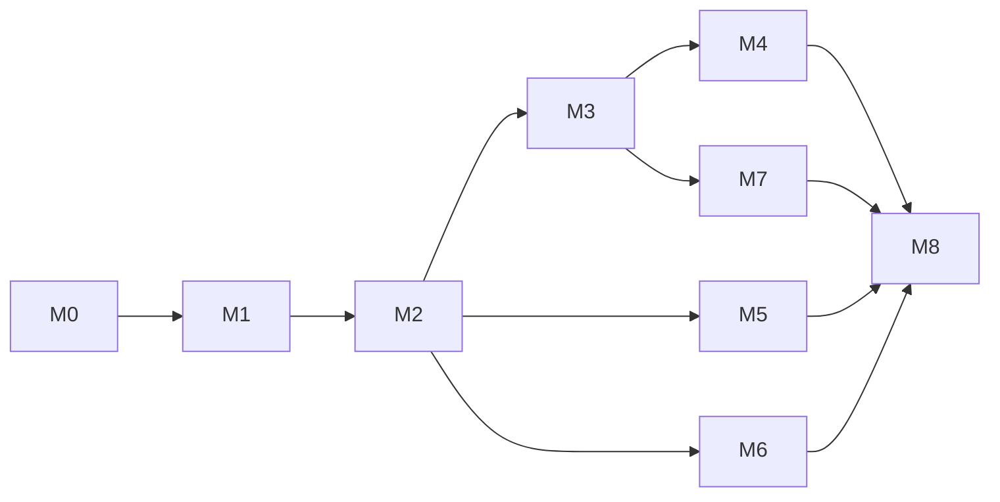

# 14 — Implementation Roadmap

The build sequence, ordered so that **the riskiest, highest-credit thing (the local-first sync engine)
is proven early**, and every milestone is independently demoable.

## 1. Sequencing principle

Build **vertically by risk**, not horizontally by layer. The CRDT/offline/merge path is where the
assignment is won or lost, so it comes first — even before pretty UI. Auth and CRUD are well-trodden;
they slot in once the hard core works.

## 2. Milestones

### M0 — Foundations (scaffold)

- Single **Next.js 16** app (TS + Tailwind + shadcn) with a **custom Node server** (`server.ts`) ready
  to host both the Next handler and a WebSocket; `lib/{db,validators,crdt,realtime,types}` modules.
- Prisma schema ([04](./04-data-model.md)) + first migration + seed.
- CI skeleton (lint/typecheck/test) ([13](./13-deployment-and-cicd.md)).
- **Exit:** repo builds, CI green, DB migrates, app boots (custom server) with a placeholder page + footer.

### M1 — Local-first editor (no server yet) ⭐ highest risk first

- Tiptap editor bound to a `Y.Doc`; `y-indexeddb` persistence.
- Open/edit/reload works fully offline; nothing blocks the UI.
- Unit/property test: convergence + idempotency ([12](./12-testing-strategy.md)).
- **Exit:** type in two tabs of the same browser (BroadcastChannel) and watch them merge offline.

### M2 — Realtime layer + multi-client merge

- `lib/realtime` (in the custom `server.ts`): Yjs WS protocol, one room per doc, in-memory doc, broadcast.
- Custom client provider + reconnection state machine + outbox ([05](./05-local-first-and-sync-engine.md)).
- Persist updates to Postgres (append-only log); load on join via state-vector delta.
- **Exit:** two browsers, two machines, concurrent edits converge; offline edits reconcile on
  reconnect with no loss. (This is the core demo — E2E #1/#2.)

### M3 — Auth + RBAC

- Auth.js (JWT) sign-in; Prisma adapter.
- `DocumentMembership` + scoped query helpers; documents list (SSR); sharing/invite.
- **WS server verifies JWT + enforces roles; Viewers rejected (M3).**
- **Exit:** Owner/Editor edit & sync; Viewer is read-only and cannot push (E2E #3).

### M4 — Version history & time travel

- Manual + auto snapshots; timeline UI; read-only preview; **forward-transaction restore**
  ([07](./07-version-history.md)).
- **Exit:** restore an old version with two users connected; both converge; history intact (E2E #4).

### M5 — Security & validation hardening

- WS payload caps, rate limiting, bounded decode, per-room/per-process budgets, strike/ban
  ([09](./09-security-and-validation.md)).
- Zod everywhere; optional Postgres RLS; CSP/headers.
- **Exit:** integration tests for oversize/flood/malformed/viewer-write all pass; server survives abuse.

### M6 — Performance & lifecycle

- Debounce/throttle persistence + awareness; compaction + Yjs GC + snapshot thinning
  ([11](./11-performance-and-scale.md)).
- Code-splitting (editor lazy), SSR list, connection-status indicator polished.
- **Exit:** typing-latency probe within budget; cold load uses compaction; memory stable across
  open/close cycles.

### M7 — AI add-ons

- Server-proxied AI routes (summarize, inline assist, version-diff explanation, semantic snapshot
  naming) via Vercel AI SDK + Google Gemini ([10](./10-ai-features.md)); rate limits + caps + caching.
- **Exit:** stream a summary; explain a version diff; auto-name a snapshot.

### M8 — Polish, accessibility, deploy, docs

- Accessibility pass (keyboard, `aria-live` sync announcements, focus, color-independent status).
- Responsive layout; empty/error states; toasts.
- Deploy the single Next.js 16 app + Postgres on Railway; CI/CD with preview deploys; `.env.example`.
- README: setup, architecture summary, **security write-up** (OOM + tenant isolation), live links,
  **footer with name/GitHub/LinkedIn**.
- **Exit:** live URL works end-to-end; submission checklist ([README](./README.md)) complete.

## 3. Dependency graph



M1→M2 is the critical path. M5/M6/M7 can proceed in parallel once M2/M3 exist.

## 4. Definition of done (per the rubric)

- [ ] Offline edit + reconnect reconciles deterministically, no data loss (E1).
- [ ] Concurrent multi-user merge, no conflict dialog (E1).
- [ ] Version timeline + safe restore that doesn't corrupt collaborators (E1, E6).
- [ ] Auth + Owner/Editor/Viewer; **Viewers can't push** (E1, M3).
- [ ] Sync payload validation + OOM defenses + tenant isolation (E1, M4, M5).
- [ ] Live connection-status indicators + accessibility (E2).
- [ ] No typing lag; document-size lifecycle handled (E3, E6).
- [ ] Tests, esp. sync engine (E4).
- [ ] Deployed with CI/CD (E5).
- [ ] AI add-ons working (F6).
- [ ] Footer with name/GitHub/LinkedIn; repo + live URL submitted (S1, S2).

## 5. Risks & mitigations

| Risk                                               | Mitigation                                                                                  |
| -------------------------------------------------- | ------------------------------------------------------------------------------------------- |
| WS on serverless won't work                        | Custom Node server + Railway from M0 (no serverless host)                                   |
| CRDT integration subtleties (echo loops, presence) | Property tests early (M1); origin tagging                                                   |
| Restore corrupting shared state                    | Forward-transaction model, tested (M4, [07](./07-version-history.md))                       |
| Document growth / quota                            | Compaction + GC + thinning designed in (M6, [11](./11-performance-and-scale.md))            |
| Scope creep on AI                                  | AI is additive & flag-gated; core works without it (M7)                                     |
| HTTP vs WebSocket validation drift                 | One app: route handlers + realtime layer import the **same** Zod validators + Prisma client |

## 6. Suggested file structure (target)

```
conflux/                 # one Next.js 16 app (see [02] §6 for the full tree)
  server.ts              # custom Node entry: Next.js handler + WebSocket (realtime layer)
  app/                   # App Router: pages + api/ route handlers
  components/            # editor, sync UI, shadcn/ui
  lib/
    db/                  # Prisma client + scoped query helpers
    validators/          # Zod schemas (used by route handlers AND the realtime layer)
    crdt/                # Y.Doc factory, providers, snapshot/compaction utils
    realtime/            # rooms, auth+role enforcement, payload validation, persistence
    sync/  auth/  ai/    # client sync engine · Auth.js config · Vercel AI SDK (Google)
  prisma/                # schema.prisma + migrations + seed
  .github/workflows/ci.yml
  .env.example  README.md
  docs/                  # ← this planning folder
```

---

**Next step after plan approval:** start at **M0**, then **M1**. Do not begin coding until this plan is
reviewed (per the original instruction: plan first, no code yet).
